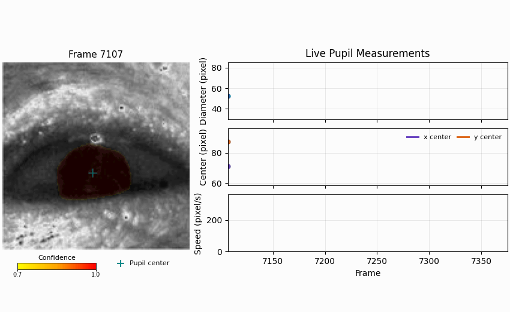

[](https://github.com/yzhaoinuw/agent_collab_treaty)



<p align="center"><em>Left: confidence-colored pupil mask and estimated center — Right: evolving pupil diameter, center, and speed</em></p>

See [`media/README.md`](media/README.md) to regenerate and review the demo GIF.

# Pupil Analysis Pipeline

This package runs a full pipeline for **mouse pupil segmentation and size estimation** using a trained UNet model.  
You can start directly from a video file or from an existing folder of extracted frames. To obtain expected results, the video or images provided should have at least the majority of the eye contained in the 148 x 148 pixel area in the center of the frames. This is crucial to getting good results because the model was trained on 148 x 148 centered eye images.  

---

## 📦 Installation

It is recommended that you first create a dedicated virtual environment, for example with [Miniconda](https://www.anaconda.com/docs/getting-started/miniconda/install):

```bash
conda create -n pupil_tracking python=3.12
conda activate pupil_tracking
```

Then install the package:

```bash
pip install mouse-pupil-analysis
```

The trained model checkpoint ships with the package, so there is nothing else to download.

> **Note on names.** The distribution is `mouse-pupil-analysis`, but the import name is `pupil_tracking`:
> `pip install mouse-pupil-analysis` then `import pupil_tracking`. The shorter name `pupil-tracking` on
> PyPI belongs to an unrelated project by a different author.

### GPU / CPU builds of PyTorch

On **Windows and macOS**, the command above installs a CPU-only build of PyTorch (~120 MB), which is all this package needs to run. No action required.

On **Linux**, the default PyPI wheel bundles CUDA and is roughly 500 MB. If you do not have an NVIDIA GPU, install the CPU-only build first to avoid the download:

```bash
pip install torch torchvision --index-url https://download.pytorch.org/whl/cpu
pip install mouse-pupil-analysis
```

To use an **NVIDIA GPU**, install the matching CUDA build first, replacing `cu124` with your CUDA version (see [pytorch.org](https://pytorch.org/get-started/locally/)):

```bash
pip install torch torchvision --index-url https://download.pytorch.org/whl/cu124
pip install mouse-pupil-analysis
```

Inference selects the GPU automatically when one is available and falls back to CPU otherwise.

### Installing for development

```bash
git clone https://github.com/yzhaoinuw/pupil_tracking.git
cd pupil_tracking
pip install -e ".[dev]"
```


## 🏃 Basic Usage
After installation, you can run pupil analysis on a video like so
```bash
run-pupil-analysis --video_path /path/to/movie.avi
```

This will:

1. Extract evenly spaced frames from the video into a folder like `movie_frames/`
2. Run pupil segmentation and diameter estimation on those frames
3. Save the results (CSV + plot) into `movie_frames_result/`

To calculate pupil-center position and velocity from every encoded frame, add
`--calculate_velocity` and provide the actual acquisition rate when it differs
from the video playback rate:

```bash
run-pupil-analysis \
  --video_path data/mouse1.avi \
  --calculate_velocity \
  --acquisition_fps 33.3333333333
```

Velocity mode calculates timestamps from the original source-frame index and
the acquisition rate. It does not assume that the FPS stored in the video
container always represents experimental time.

For the end-to-end methodology—from segmentation probabilities through pupil-center quality control and velocity—see [Segmentation-To-Velocity Method](project_overview.md#segmentation-to-velocity-method).

## Try the Included Sample Data

The repository includes a compact set of real images and hand-labeled masks under [`sample_data/`](sample_data/README.md). It supports clone-and-run checks of uncropped-frame inference, overlays, paired training data, augmentation, and a 31-frame pupil-velocity sequence.

```bash
run-pupil-analysis \
  --image_dir sample_data/velocity_frames \
  --result_dir results/sample_velocity \
  --output_mask_dir results/sample_velocity/overlays \
  --calculate_velocity \
  --acquisition_fps 97
```

The fixture is intended for workflow exploration and debugging, not scientific model evaluation or useful model training. See the [sample-data guide](sample_data/README.md) for the uncropped-frame and training examples.

---

## ⚙️ Key Arguments

| Argument            | Description                                                                                                       |
|---------------------|-------------------------------------------------------------------------------------------------------------------|
| `--video_path`      | Path to the input video file. If provided, frames will automatically be extracted before analysis.                |
| `--out_dir`         | Optional. Directory to save extracted frames. If not given, defaults to `<video_stem>_frames/` next to the video. |
| `--image_dir`       | Optional alternative to `--video_path`. Use this if you already have extracted PNG frames.                        |
| `--result_dir`      | Optional. Directory to save the CSV and plot outputs. If not given, defaults to `<image_dir>_result/`.            |
| `--checkpoint`      | Optional. Path to a custom model checkpoint. If not provided, the packaged checkpoint is used.                   |
| `--output_mask_dir` | Optional. If provided, saves translucent confidence-heatmap overlays for threshold-passing pupil pixels. Yellow is closest to the prediction threshold, orange is intermediate, and red is near-perfect confidence. |
| `--extraction_fps`  | Optional. Specifies the number of frames per second at which to extract the frames from the video (default: 5). If `--max_frames` is provided, and if the number of frames to be extracted at `--extraction_fps` would exceed `--max_frames`, then the actual `--extraction_fps` will be automatically reduced so that `--max_frames` number of frames will be extracted. |
| `--max_frames`      | Optional. Limits the maximum number of frames to extract from a video (default: 10,000). Useful for long recordings.        |
| `--pred_thresh`     | Optional. Ranging from 0 to 1, it specifies the confidence threshold for classifying a pixel as belonging to the pupil. For example, a value of 0.7 means that a pixel will be classified as a pupil pixel only if model confidence exceeds 0.7. Increase it if the resulting segmentation overpredicts the pupil; reduce it if the resulting segmentation only finds part of the pupil. |  
| `--calculate_velocity` | Optional. Analyzes every encoded source frame and appends pupil-center, speed, and segmentation-quality fields and plot panels to the unified analysis outputs. |
| `--num_workers`     | Optional. Number of dataloader worker processes (default: up to 4, capped by CPU count). Use `0` to load frames in the main process, which is often faster for short recordings. |
| `--acquisition_fps` | Actual experimental sampling rate used for timestamps and velocity. In velocity mode this is required with `--image_dir`; with video input it defaults to the video header rate when omitted. |

---

## 💡 Examples

**From a video (auto frame extraction):**
```bash
run-pupil-analysis --video_path data/mouse1.avi
```

**From an existing folder of frames:**
```bash
run-pupil-analysis --image_dir data/mouse1_frames
```

**With custom output locations and segmentation masks:**
```bash
run-pupil-analysis \
  --video_path data/mouse1.avi \
  --out_dir data/frames_mouse1 \
  --result_dir data/results_mouse1 \
  --output_mask_dir data/masks_mouse1
```

---

## 🐍 Python API

Everything the CLI does is available from Python, which is usually more convenient
inside a notebook or a larger analysis script. The results come back as a DataFrame,
so there is no need to read the CSV back in.

```python
from pupil_tracking import analyze_video

result = analyze_video("data/mouse1.avi")
print(result.analysis_table.head())
print(result.csv_path, result.plot_path)
```

Velocity mode and every CLI flag are keyword arguments:

```python
result = analyze_video(
    "data/mouse1.avi",
    calculate_velocity=True,
    acquisition_fps=33.3333333333,
    output_mask_dir="data/masks_mouse1",
)

usable = result.analysis_table.query("tracking_status != 'invalid'")
print(f"{len(usable)} of {len(result.analysis_table)} frames usable")
```

To start from frames you already extracted, use `analyze_frames` instead:

```python
from pupil_tracking import analyze_frames

result = analyze_frames("data/mouse1_frames", acquisition_fps=33.3333333333)
```

`result` is an `AnalysisResult` with these fields:

| Field | Description |
|---|---|
| `analysis_table` | The same compact table written to CSV, as a DataFrame. |
| `csv_path`, `plot_path` | Locations of the written outputs. |
| `tracking_dataframe` | Detailed per-frame quality evidence in velocity mode, otherwise `None`. Retains raw centers, component areas, confidence, circularity, and temporal-area calculations that the compact table omits. |
| `image_frames` | Frame metadata linking each image name to its source-frame index. |

For repeated runs with shared settings, build an `AnalysisConfig` once and pass it to
`run_analysis`:

```python
from pupil_tracking import AnalysisConfig, run_analysis

for video in Path("data").glob("*.avi"):
    run_analysis(AnalysisConfig(video_path=video, pred_thresh=0.75))
```

Library code logs rather than prints, so it stays quiet by default. To see the same
progress messages the CLI shows:

```python
import logging
logging.basicConfig(level=logging.INFO)
```

---

## 📦 Output Files

After running, you’ll typically find:

| File | Description |
|------|--------------|
| `*_pupil_analysis.csv` | Unified table containing `image_name` and pupil diameter in both model and video pixels. Velocity mode appends timestamp, accepted x/y center, speed, three-state tracking status, and a concise quality reason. Generated image names contain the one-based source-frame number. |
| `*_pupil_analysis.png` | Unified frame-indexed plot. Velocity mode appends x/y center, speed, and valid/warning/invalid quality-control panels below pupil diameter. |
| *(optional)* Mask images in `output_mask_dir` | PNGs with a translucent yellow-orange-red confidence heatmap over threshold-passing pupil pixels. Velocity mode also marks the raw pupil center with a thin translucent cross: cyan for accepted candidates and yellow for rejected candidates. |

### Units

Pupil diameter is reported twice, in two different units:

- `estimated_pupil_diameter` is measured in the 148 x 148 model image. Because every
  frame is rescaled to that size, this value is **not comparable between recordings**
  with different resolution or cropping. It is kept for continuity with earlier results.
- `pupil_diameter_video_pixels` inverts the resize-and-pad geometry to express the same
  measurement in original-video pixels. **Use this one when comparing across recordings.**

Both are equivalent-circle diameters: the diameter of a circle whose area matches the
segmented pupil mask, `sqrt(4 / pi * area)`.

Pupil-center coordinates are reported in original-video pixels. The x
coordinate increases to the right and the y coordinate increases downward.
Velocity is reported in pixels per second.

Neither unit is physical. Converting to millimeters requires a scale factor from your
own optics, which this package does not attempt to infer.

The compact analysis CSV reports `tracking_status` as `valid`, `warning`, or
`invalid`, with `quality_reason` identifying suspicious or rejected frames.
Published center and speed fields are left empty when segmentation is rejected.
Speed is also left empty when either adjacent frame is invalid or when source
frames are not consecutive; the pipeline does not interpolate across these
gaps. A warning remains usable, such as extra foreground components when the
selected pupil component is still acceptable.

---

## 🧩 Typical Folder Structure

```
movie.avi
movie_frames/
    movie_00001.png
    movie_00002.png
    ...
movie_frames_result/
    movie_pupil_analysis.csv
    movie_pupil_analysis.png
```

---

## Citation

If you use this software in a paper or other scholarly work, please cite the version you used. GitHub renders citation metadata from [`CITATION.cff`](CITATION.cff), and the “Cite this repository” button produces BibTeX directly.

Recommended citation:

> Yue Zhao. *mouse-pupil-analysis: Automated mouse pupil segmentation, diameter, and pupil-center velocity analysis using UNet*. Version 0.1.4. https://github.com/yzhaoinuw/pupil_tracking

Each release is archived on Zenodo with its own DOI. Cite the DOI of the specific version you ran, so your analysis stays reproducible against that exact code. See [`CHANGELOG.md`](CHANGELOG.md) for what changed between versions.

## License

This project is released under the MIT License. See [`LICENSE`](LICENSE).

---

## Developer Notes

### Model Training

The complete data-preparation, augmentation, fresh-training, fine-tuning, and checkpoint-promotion workflow is documented in [`training/README.md`](training/README.md).

#### Making Training Data
Create two folders in *pupil_tracking/*, *images_train/* and *masks_train/* if you haven't. Place your training images in *images_train/*. Once you have done this once, you can just add new training images to *images_train/*.
1. In Terminal/Anaconda Powershell Prompt, activate environment pupil_tracking, then run `labelme.exe`
to open the labelme interface to label images.
2. After you are done, **labelme** should have saved your labels as json files in *images_train/* along with your training images. Now run `python .\training\labelme_json2png.py`, which will create the masks (png files) and move them to *masks_train/*.
3. To create the validation set, create *images_validation/* and *masks_validation/* and then follow the same steps above, but remember to change **dataset_type** in **training/labelme_json2png.py** accordingly.
4. To start training the model, run `python .\training\run_train.py`. You can modify the hyperparameters in **training/run_train.py** as needed.
